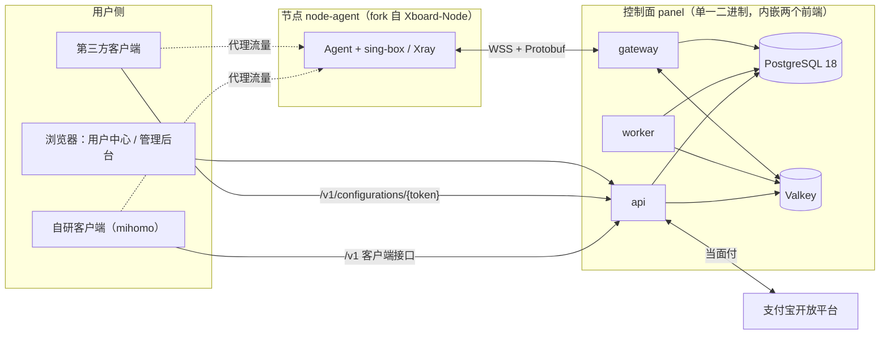

# 01 系统架构

适用范围：全部仓库。

## 1.1 组成

| 组件 | 职责 |
|---|---|
| api | 客户端接口、管理接口、第三方配置导出、支付通知、内嵌前端 |
| gateway | 节点接入（`/v1/enrollments`）、长连接（握手、同步、指令下发、接收上报）、执行 Lua 入账（spec/22 ACC-03）、发放配额租约（ACC-08） |
| worker | 流量落库、到期扫描、周期重置、分区维护、outbox 投递与对账、通知投递、支付查询兜底、权限协调器（spec/11 ACS-02）、超额处理（spec/22 ACC-04）、幂等键清理 |
| PostgreSQL | 账本与全部业务数据的事实来源 |
| Valkey | 实时用量、缓存、限流、握手防重放、跨实例消息 |
| node-agent | 承载代理流量，计量，执行控制面指令 |

三个角色由同一个二进制的子命令启动（`panel api|gateway|worker|all`），单机部署使用 `all`。迁移由单独的子命令 `panel migrate` 执行（spec/40 DEP-12），首个超级管理员由 `panel admin create` 创建（spec/10 AUTH-21）。

## 1.2 仓库与许可证

| 仓库 | 内容 | 许可证 |
|---|---|---|
| `panel-spec` | 节点协议 proto、客户端与管理接口 OpenAPI、生成的类型 | Apache-2.0 |
| `panel` | 控制面后端 `server/`、前端 `web/`（portal、admin、ui、sdk）、部署文件 | AGPL-3.0-or-later |
| `node-agent` | fork 自 cedar2025/Xboard-Node，通信层替换为本项目协议 | GPL-3.0-or-later；原有文件保留 MPL-2.0 声明 |
| `sing-box`、`xray-core` | 内核 fork，复制自 Xboard-Node 所用的 fork 并锁定提交 | 继承上游 |
| `client` | 自研客户端，内嵌 mihomo（1.0 之后） | GPL-3.0-or-later |
| `workspace` | 规格、ADR、任务、Claude Code 配置、本地开发环境 | Apache-2.0 |
| `.github` | 组织级 SECURITY、行为准则、模板 | — |

`panel-spec` 生成的类型与客户端（Apache-2.0）是一份产物；`panel/web/sdk` 在其基础上封装请求与鉴权，属于 `panel` 仓库，按 AGPL-3.0-or-later 分发。

- **ARC-01** 协议与接口的定义只存在于 `panel-spec`：节点协议（含接入接口，spec/20 NODE-18）用 proto，客户端与管理接口用 OpenAPI。其他仓库引用其打过 tag 的版本，不复制定义。
- **ARC-02** 一次提交只修改一个仓库。跨仓功能按“先 `panel-spec`，再各实现仓库”的顺序合并；新行为通过节点能力位开关，因此实现仓库之间的合并顺序无关。
- **ARC-03** 贡献采用 DCO（`Signed-off-by`），不使用 CLA。
- **ARC-04** 控制面的 AGPL 义务：用户中心与管理后台页脚显示“源代码”链接，指向当前运行版本的仓库与提交（由服务端注入，运营者可改为自己的 fork）。`-tags noui` 部署中，运营者自行托管的前端同样必须保留该链接（spec/40 DEP-06）。

## 1.3 主要数据流

1. **购买**：用户中心或客户端创建报价 → 下单 → 支付宝扫码 → 通知验签 → 开通权益 → 权限协调器向相关节点下发凭据（spec/11、spec/12）。
2. **连接**：客户端取得结构化配置（自研）或导出配置（第三方）→ 直连节点，流量不经过控制面（spec/23、spec/30）。
3. **计量**：节点按凭据计数 → 写 WAL → 上报 → Valkey 原子入账与超额判定 → worker 落库（spec/22）。
4. **到期**：worker 发现到期 → 权益结束 → 回到免费账号 → 凭据从节点移除（spec/11）。

## 1.4 开发顺序

控制面优先（ADR 0013）：M1 控制面与两个前端，M2 节点编排（使用模拟 Agent），M3 改造 Agent 并发布 v0.1。详见 `../backlog/README.md`。
