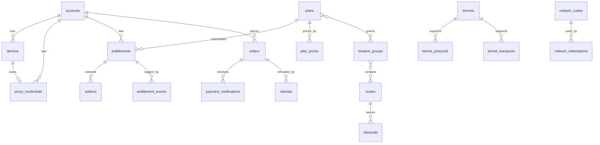

# 03 数据模型

适用范围：`panel/server/migrations`。字段级定义以迁移文件为准（起步为 `00001_init.sql`），本文件说明表的分组、关系与约束意图。

`00001_init.sql` 在 M0-05 提交之前可以直接修改；提交之后，所有改动都通过新的迁移完成（CONV-21）。M0-05 需要让 00001 满足本文件与 spec/02 的全部约束，包括删除 `-- +goose Down` 段，以及补齐 CONV-17 要求的列与触发器。

## 3.1 分组

| 分组 | 表 | 规格 |
|---|---|---|
| 账号与认证 | `accounts`、`roles`、`account_roles`、`staff_invitations`、`mfa_totp`、`mfa_webauthn`、`verification_codes`、`sessions`、`devices` | spec/10 |
| 凭据与导出 | `proxy_credentials`、`export_tokens`（`token_hash` 与 `token_enc`） | spec/10、spec/23 |
| 节点 | `kernels`、`kernel_protocols`、`kernel_transports`、`machines`、`nodes`（含 `last_report_seq`）、`location_groups`、`node_group_members`、`inbounds`（非敏感配置在 `settings`，私钥在 `secrets_enc`）、`node_routes` | spec/20、spec/21 |
| 套餐与权益 | `plans`、`plan_groups`、`plan_prices`、`addon_prices`、`entitlements`、`entitlement_events`、`addons`、`usage_cycles` | spec/11 |
| 订单与支付 | `quotes`、`orders`（含 `payer_ref_hash`、累计退款）、`payment_providers`、`payment_notifications`、`refunds`、`credit_ledger`（视图 `account_balances`）、`coupons`、`coupon_redemptions`、`redeem_codes`、`redeem_redemptions` | spec/12 |
| 流量 | `ingest_batches`、`traffic_hourly`（按月分区，按账号、节点、小时）、`traffic_daily` | spec/22 |
| 运营 | `announcements`、`support_tickets`、`support_messages`、`support_attachments`、`articles`、`referral_earnings`、`notification_templates`、`notification_preferences`、`notification_outbox` | spec/13 |
| 基础设施 | `settings`、`outbox`、`consumed_events`、`idempotency_keys`、`job_fencing`、`audit_logs`（含 `reason`、`request_id`） | spec/02、spec/40 |

## 3.2 关系

## 3.3 数据库强制的约束

| 约束 | 实现方式 |
|---|---|
| 每个账号至多一个当前权益、至多一个下一段 | 部分唯一索引 `entitlements_current_uq`、`entitlements_scheduled_uq` |
| 到期扫描覆盖 `active`、`over_quota`、`suspended` | 部分索引 `entitlements_expiry` 的条件包含这三种状态（spec/11 BIL-13） |
| 每个账号同时至多一个未支付的变更类订单，以及至多一个未支付的新购订单 | 部分唯一索引 `orders_one_pending_change`、`orders_one_pending_new`（spec/12 ORD-02） |
| 价格行的金额、币种、周期、`period_days` 不可修改；`on_sale` 只能由真变假；不可删除 | 触发器 `plan_prices_immutable`（用 `IS DISTINCT FROM` 比较）、`plan_prices_nodelete`；`addon_prices` 同样处理 |
| 非免费套餐的价格金额大于 0 | 触发器或 CHECK（spec/11 BIL-01） |
| 入站协议与传输必须被节点内核支持，实验协议需要节点允许 | 触发器 `inbounds_kernel_guard`、`nodes_kernel_guard`，依据 `kernel_protocols` 与 `kernel_transports` |
| 只追加表不可修改、不可截断 | 行级触发器调用 `forbid_mutation()`，语句级 `BEFORE TRUNCATE` 触发器（CONV-18） |
| 可变表的 `updated_at` 自动维护 | 触发器 `touch_updated_at`（CONV-17） |
| 支付渠道交易号唯一 | 部分唯一索引 `orders_provider_txn_uq` |
| 每台设备至多一条有效凭据；每个账号至多一条共用凭据 | 部分唯一索引 |
| 同一账号对同一兑换码只能兑换一次 | 唯一约束 `redeem_redemptions (redeem_code_id, account_id)` |
| 百分比优惠券的 `value ≤ 10000` | CHECK |
| 幂等键按“账号或路由 + 键”唯一，未认证请求的 `account_id` 可以为空 | 唯一索引（CONV-12） |

应用层还必须保证数据库无法表达的规则，见各规格中的编号规则。例如：余额扣减后不为负，由下单事务中的账号行锁保证（spec/12 ORD-15）。
