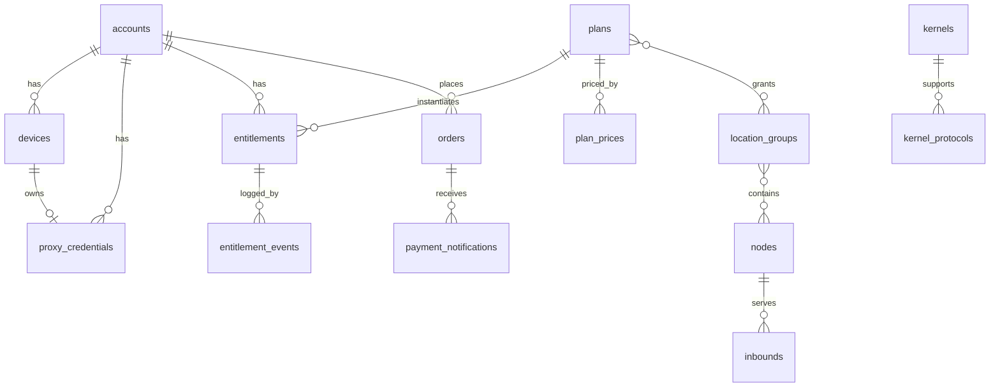

# 03 数据模型

适用范围：`panel/server/migrations`。字段级定义以迁移文件为准（起步为 `00001_init.sql`），本文件说明表的分组、关系与约束意图。

## 3.1 分组

| 分组 | 表 | 规格 |
|---|---|---|
| 账号与认证 | `accounts`、`roles`、`account_roles`、`mfa_totp`、`mfa_webauthn`、`verification_codes`、`sessions`、`devices` | spec/10 |
| 凭据与导出 | `proxy_credentials`、`export_tokens` | spec/10、spec/23 |
| 节点 | `kernels`、`kernel_protocols`、`machines`、`nodes`、`location_groups`、`node_group_members`、`inbounds`、`node_routes` | spec/20、spec/21 |
| 套餐与权益 | `plans`、`plan_groups`、`plan_prices`、`entitlements`、`entitlement_events`、`addons`、`usage_cycles` | spec/11 |
| 订单与支付 | `quotes`、`orders`、`payment_providers`、`payment_notifications`、`refunds`、`credit_ledger`（视图 `account_balances`）、`coupons`、`coupon_redemptions`、`redeem_codes` | spec/12 |
| 流量 | `ingest_batches`、`traffic_hourly`（按月分区）、`traffic_daily` | spec/22 |
| 运营 | `announcements`、`support_tickets`、`support_messages`、`articles`、`referral_earnings`、`notification_outbox` | spec/13 |
| 基础设施 | `settings`、`outbox`、`idempotency_keys`、`audit_logs` | spec/02 |

## 3.2 关系

## 3.3 数据库强制的约束

| 约束 | 实现方式 |
|---|---|
| 每个账号至多一个当前权益、至多一个下一段 | 部分唯一索引 `entitlements_current_uq`、`entitlements_scheduled_uq` |
| 每个账号同时至多一个未支付的变更类订单 | 部分唯一索引 `orders_one_pending_change` |
| 价格行金额不可修改、不可删除 | 触发器 `plan_prices_immutable`、`plan_prices_nodelete` |
| 入站协议必须被节点内核支持，实验协议需节点允许 | 触发器 `inbounds_kernel_guard`、`nodes_kernel_guard`，依据 `kernel_protocols` |
| 只追加表不可修改 | 触发器调用 `forbid_mutation()` |
| 支付渠道交易号唯一 | 部分唯一索引 `orders_provider_txn_uq` |
| 每台设备至多一条有效凭据；每个账号至多一条共用凭据 | 部分唯一索引 |

应用层还必须保证数据库无法表达的规则，见各规格中的编号规则。
