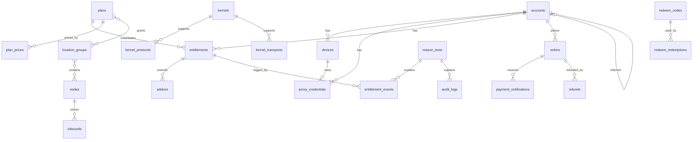

# 03 数据模型

适用范围：`panel/server/migrations`。字段级定义以迁移文件为准（起步为 `00001_init.sql`），本文件说明表的分组、关系与约束意图。

`00001_init.sql` 在 M0-05 提交之前可以直接修改；提交之后，所有改动都通过新的迁移完成（CONV-21）。M0-05 需要让 00001 满足本文件与 spec/02 的全部约束，包括删除 `-- +goose Down` 段，以及补齐 CONV-17 要求的列与触发器。

## 3.1 分组

| 分组 | 表 | 规格 |
|---|---|---|
| 账号与认证 | `accounts`、`roles`、`account_roles`、`staff_invitations`、`staff_invitation_roles`、`mfa_totp`、`mfa_webauthn`、`verification_codes`、`sessions`、`devices` | spec/10 |
| 凭据与导出 | `proxy_credentials`（`secret_enc` 的明文为 16 字节原始 UUIDv4，spec/21 AGT-15；00001 中的列注释“UUID / 密码等”已过时，由后续迁移以 `COMMENT ON COLUMN` 更正，见 backlog M1-03）、`export_tokens`（`token_hash` 与 `token_enc`） | spec/10、spec/23 |
| 节点 | `kernels`、`kernel_protocols`、`kernel_transports`、`machines`、`nodes`（含 `last_report_seq`）、`location_groups`、`node_group_members`、`inbounds`（非敏感配置在 `settings`，私钥在 `secrets_enc`）、`node_routes` | spec/20、spec/21 |
| 套餐与权益 | `plans`、`plan_groups`、`plan_prices`、`addon_prices`、`entitlements`、`entitlement_events`、`addons`、`usage_cycles` | spec/11 |
| 订单与支付 | `quotes`、`orders`（含 `payer_ref_hash`、累计退款）、`payment_providers`、`payment_notifications`、`refunds`、`credit_ledger`（视图 `account_balances`）、`coupons`、`coupon_redemptions`、`redeem_codes`、`redeem_redemptions` | spec/12 |
| 流量 | `ingest_batches`、`traffic_hourly`（按月分区，按账号、节点、小时）、`traffic_daily` | spec/22 |
| 运营 | `announcements`、`support_tickets`、`support_messages`、`support_attachments`、`articles`、`referral_earnings`、`notification_templates`、`notification_preferences`、`notification_outbox` | spec/13 |
| 基础设施 | `settings`（含只读键 `site_timezone`、`site_currency`）、`outbox`、`consumed_events`、`idempotency_keys`、`job_fencing`、`audit_logs`（含 `reason_id`、`request_id`）、`reason_texts` | spec/02、spec/40 |

## 3.2 关系

## 3.3 数据库强制的约束

| 约束 | 实现方式 |
|---|---|
| 每个账号至多一个当前权益、至多一个下一段 | 部分唯一索引 `entitlements_current_uq`、`entitlements_scheduled_uq` |
| 到期扫描覆盖 `active`、`over_quota`、`suspended` | 部分索引 `entitlements_expiry` 的条件包含这三种状态（spec/11 BIL-13） |
| 每个账号同时至多一个未支付的变更类订单，以及至多一个未支付的新购订单 | 部分唯一索引 `orders_one_pending_change`、`orders_one_pending_new`（spec/12 ORD-02） |
| 价格行的金额、币种、周期、`period_days` 不可修改；`on_sale` 只能由真变假；不可删除 | 触发器 `plan_prices_immutable`（用 `IS DISTINCT FROM` 比较）、`plan_prices_nodelete`；`addon_prices` 同样处理 |
| 非免费套餐的价格金额大于 0 | 触发器或 CHECK（spec/11 BIL-01） |
| 入站协议与传输必须被节点内核支持，实验协议需要节点允许 | 触发器 `inbounds_kernel_guard`、`nodes_kernel_guard`，依据 `kernel_protocols` 与 `kernel_transports` |
| 只追加表不可修改、不可截断 | 行级触发器调用 `forbid_mutation()`，语句级 `BEFORE TRUNCATE` 触发器（CONV-18） |
| 可变表的 `updated_at` 自动维护 | 触发器 `touch_updated_at`（CONV-17） |
| 支付渠道交易号唯一 | 部分唯一索引 `orders_provider_txn_uq` |
| 每台设备至多一条有效凭据；每个账号至多一条共用凭据 | 部分唯一索引 |
| 同一账号对同一兑换码只能兑换一次 | 唯一约束 `redeem_redemptions (redeem_code_id, account_id)` |
| 百分比优惠券的 `value ≤ 10000` | CHECK |
| 幂等键按“账号或路由 + 键”唯一，未认证请求的 `account_id` 可以为空 | 唯一索引（CONV-12） |
| `site_timezone`、`site_currency` 初始化后只读 | 触发器 `settings_readonly`（CONV-08、CONV-26） |
| 只追加表不保存原因原文；`admin_adjust` 权益事件必须带原因 | `reason_id` 外键引用 `reason_texts`；CHECK `type <> 'admin_adjust' OR reason_id IS NOT NULL`（CONV-29） |
| `tier = 0` 只属于免费套餐 | CHECK `(kind = 'free') = (tier = 0)`（spec/11 11.1） |
| 至多一个免费套餐 | 部分唯一索引 `plans_single_free ON plans (kind) WHERE kind = 'free'`（spec/11 BIL-15） |
| 免费套餐不设价格行 | 插入触发器 `plan_prices_plan_guard`（spec/11 BIL-01） |
| 价格行周期与套餐类型匹配 | 插入触发器 `plan_prices_period_guard`：`one_time` 套餐只用 `one_time`，其他套餐不用 `one_time`；`period_days` 只用于 `one_time`（spec/11 BIL-01、BIL-09） |
| 已有价格行的套餐不能修改 `kind` | 触发器 `plans_kind_guard`（`BEFORE UPDATE OF kind`）。BIL-26 的其余条件（没有权益、未被设置 `free_plan_id` 引用）由应用层检查 |
| 余额流水的方向由原因决定 | CHECK：`order_payment`、`account_deletion` 为负；`referral`、`admin_adjust` 可正可负；其余为正（spec/12 ORD-16） |
| 加购报价引用加购价格，其他报价引用套餐价格 | `quotes` 的 CHECK：`(order_type = 'addon') = (addon_price_id IS NOT NULL)`，`price_id` 与 `addon_price_id` 恰有一个非空 |
| 原路退款不超过累计退款 | CHECK `refunded_original_minor <= refunded_minor` |

应用层还必须保证数据库无法表达的规则，见各规格中的编号规则。例如：余额扣减后不为负，由下单事务中的账号行锁保证（spec/12 ORD-15）。

## 3.4 M0-05 定稿时补入的列

以下列在 M0-05 修订 00001 时加入，字段级定义以 `00001_init.sql` 为准。

| 表 | 列 | 用途 |
|---|---|---|
| `accounts` | `referrer_id`（原 `referred_by`，按 CONV-17 改名） | 邀请人 |
| `roles` | `is_builtin` | 内置角色不可修改、不可删除（spec/10 AUTH-22），由应用层保证 |
| `sessions` | `audience`（`client` 或 `console`） | 令牌受众（spec/10 AUTH-06、AUTH-21） |
| `sessions` | `ip_prefix` | 来源 IP 的 /24 或 /48 前缀（CONV-24），用于 AUTH-07 |
| `mfa_totp` | `last_used_step` | 同一时间步内已用过的码不得再次使用（spec/10 AUTH-11） |
| `quotes`、`orders`、`addons` | `addon_price_id` | 加购项引用的加购价格 |
| `addons` | `paid_minor` | 加购项实付，单独退款的依据（spec/11 BIL-25） |
| `orders` | `refunded_original_minor` | 累计退款中原路退回的部分 |
| `refunds` | `addon_id` | 加购项单独退款（BIL-25） |
| `support_tickets` | `status_changed_at` | 自动关闭与重新打开的判定依据（spec/13 OPS-11） |
| `notification_outbox` | `retry_until`、`failed_at`、`secret_variables_enc` | 最长重试时间与最终失败（OPS-02）；含令牌、验证码或链接的变量（CONV-31） |
| `coupons`、`redeem_codes` | `disabled_at` | 停用时间 |
| `entitlement_events`、`audit_logs` | `reason_id` | 原因文本引用（CONV-29） |

## 3.5 内核基线

`kernel_protocols` 与 `kernel_transports` 的初始数据与 spec/21 21.2 的两张矩阵一致（不支持的组合没有行）：

| 内核 | 协议 | 传输 |
|---|---|---|
| `singbox` | 稳定：`vless`、`vmess`、`trojan`、`shadowsocks`、`hysteria2`、`tuic`、`anytls` | 稳定：`tcp`、`ws`、`grpc`、`httpupgrade`、`quic` |
| `xray` | 稳定：`vless`、`vmess`、`trojan`、`shadowsocks`；实验：`hysteria2` | 稳定：`tcp`、`ws`、`grpc`、`httpupgrade`、`xhttp`、`mkcp`；实验：`quic` |

两张表分别以（内核, 协议）与（内核, 传输）为键，表达不了“协议 + 传输”的组合限制，已知限制见 spec/21 21.2。

## 3.6 M1 补入的列与设置键

settings 键的读取总则：
- 读取永不因值异常而失败（不返回 500）。每个键的“缺键”取默认值；“值异常”（类型或取值不符合本表）的处理在各行中规定，并记一条 warn 日志，只记键名（CONV-24）。
- 安全相关的键按关闭方向处理（如注册控制键异常时关闭注册），可用性相关的键按不限制方向处理（如 `min_version` 异常时不限制版本）。
- 值异常只可能来自直接改库或回滚到旧二进制（管理接口写入时校验）。因值异常导致的有效值变化不写 `config_issued_at`，与 OPS-08 模块屏蔽的例外相同（spec/30 API-11）。
- 管理接口 `GET /v1/settings` 返回有效值，存储值保留，直到运营者显式修改；这一条约束设置管理接口的实现（backlog M1-09）。

| 位置 | 名称 | 用途 |
|---|---|---|
| `sessions` 列 | `absolute_expires_at`（可空） | 会话链的绝对失效时间：客户端会话自首次登录起 90 天，管理会话 12 小时；轮换时继承，为空时以 `expires_at` 为准（spec/10 AUTH-07、AUTH-21）。可空以兼容上一版本二进制（spec/40 DEP-12） |
| `settings` 键 | `registration_policy` | `"open"`、`"invite_only"`、`"closed"`，默认 `"open"`（spec/10 AUTH-02）；管理接口字段同名。缺键按 `"open"`；值存在但不是这三个 JSON 字符串之一（包括非字符串）即为值异常。三个注册控制键（本键与两个邮箱域名名单）中只要有一个值异常，有效注册策略就是 `"closed"`：`/v1/config` 下发 `closed`，注册返回 403 `registration_closed` |
| `settings` 键 | `email_domain_allowlist`、`email_domain_denylist` | 邮箱域名白名单与黑名单，JSON 字符串数组，默认空（AUTH-02）；管理接口字段同名。缺键按空名单；值不是数组，或数组中有非字符串元素，即为值异常，有效注册策略为 `"closed"`（见 `registration_policy` 行） |
| `settings` 键 | `smtp` | SMTP 投递设置（spec/13 OPS-01），JSON 对象 `{host, port, username, from_address, tls}`，字段与管理接口的 `settings.smtp` 同名。`tls` 取 `starttls`（缺省，要求 STARTTLS，服务器不支持即投递失败）、`implicit`（隐式 TLS，常用端口 465）、`none`（明文，只用于本机或可信内网中继，例如开发环境的 Mailpit）。保存时拒绝端口 465 与 `starttls` 的组合、`none` 与用户名的组合（`not_allowed`）。不提供跳过证书校验的选项 |
| `settings` 键 | `min_version` | 客户端最低版本（spec/30 API-03、API-11），JSON 对象，键为 `ClientPlatform`（`ios`、`android`、`windows`、`macos`、`linux`），值为 `x.y.z`，默认 `{}`；管理接口字段同名，更新时可选；平台或版本格式错误返回 `invalid_format`（`errors[].field` 如 `min_version.ios`）；更新时整体替换，提交 `{}` 解除全部限制。读取时可用性优先：值不是对象时视为 `{}`；某平台的值不是合法 `x.y.z` 时忽略该平台；未知平台键忽略。`min_version` 依据客户端自报的 User-Agent，不是安全控制（API-03），不按关闭方向处理 |
| `settings` 键 | `features` | 运营模块开关（spec/13 OPS-08），JSON 对象，键为模块名（`announcements`、`articles`、`support`、`referrals`、`diagnostics`），值为布尔。只有值为 JSON `true` 才算开启，`false` 与缺键等价；站点初始化时不写入，缺省即全部关闭。读取永不因此键失败：值不是对象时视为全部关闭，某键的值不是 `true` 时视为关闭，未知键忽略；值异常时记一条 warn 日志，只记键名（CONV-24）。管理接口字段同名，更新时可选；`features` 本身为 `null` 或非对象时返回 `invalid_format`（`errors[].field` 为 `features`）；按键合并：只修改提交的模块，未提交的保持原值（与 `min_version` 的整体替换不同：开关没有“删除”语义，整体替换只会让漏交的模块被意外关闭）；值为 `null` 或非布尔、模块名未知，返回 `invalid_format`（`errors[].field` 如 `features.support`）；实现须按键逐一校验，不得用生成的结构体解码而静默丢弃未知键。开启本二进制未实现的模块返回 `not_allowed`，提交 `false` 始终允许；读取时的有效值见 OPS-08 |
| `settings` 键 | `config_issued_at` | `/v1/config` 的 `issued_at`（spec/30 API-11），秒精度 RFC 3339 字符串，固定为 UTC 形式 `YYYY-MM-DDTHH:MM:SSZ`；站点初始化时写入；值异常（不是该形式的 JSON 字符串，或不是合法的日历时刻）时按缺键处理：`GET /v1/config` 以注入的时钟的当前时刻覆盖（与惰性初始化同一路径，条件为存储值仍是该异常值），记 warn 日志只记键名（CONV-24）；若异常值覆盖了更晚的时刻，已接受更晚文档的客户端会拒绝新文档，直到 `issued_at` 超过该时刻，只有直接改库才会出现，可以接受；写入路径（修改设置时的递增）遇到异常值则失败（fail-closed），不改变；`features`、`registration_policy`、`min_version` 的有效值实际变化时，在同一事务中写入 `max(当前时刻, 上一次的值 + 1 秒)`，严格递增，规则见 API-11；不在管理接口中暴露 |
| `settings` 键 | `smtp_password_enc` | SMTP 密码密文（CONV-19）；管理接口只返回 `smtp.has_password` |
| `roles` 列 | `description`（`text`，可空） | 自定义角色的描述，管理接口 `Role.description`（spec/10 AUTH-22）。内置角色为空，界面按角色名本地化 |
| 表 | `staff_invitation_roles`（`staff_invitation_id`、`role`、`created_at`，主键为两列） | 一次邀请授予的角色，可以多个（AUTH-22）。`staff_invitation_id` 引用 `staff_invitations(id)` `ON DELETE CASCADE`；`role` 引用 `roles(name)` `ON DELETE CASCADE`，使已接受、已撤销、已过期的邀请不阻止删除角色；仍被 `pending` 邀请引用的角色由应用层拒绝删除（409 `invalid_state`）。纯关联表，没有 `updated_at`（CONV-17） |
| `staff_invitations` 列 | `role`（废弃） | 由 `staff_invitation_roles` 取代。按 spec/40 DEP-12 分两步：本次迁移去掉 `NOT NULL`，应用不再读写；下一个小版本的迁移删除该列 |
| `plans` 列 | `version`（`bigint NOT NULL DEFAULT 1`，CHECK `version > 0`） | 套餐 ETag 的来源（spec/31 CON-05、CONV-28）。应用在修改套餐、新建或停售其价格行、添加或移除线路组关联时，在同一事务中加 1（backlog M1-04） |
| `location_groups` 列 | `version`（`bigint NOT NULL DEFAULT 1`，CHECK `version > 0`） | 线路组 ETag 的来源。应用在修改线路组、增减节点成员时，在同一事务中加 1（`host_count` 因此随版本变化）；节点状态变化不加 1；套餐关联变化只影响派生字段 `plan_ids`，不加 1（CON-05） |
| `plans` 索引 | `plans_single_free`、`plans_sort`（`sort, id`） | 前者见 3.3；后者用于管理接口 `GET /v1/plans` 的游标分页（按 `sort`、`id` 升序，CONV-11）。该表已有数据，两个索引在迁移 00007 中以 `CREATE INDEX CONCURRENTLY` 建立并标记 `-- +goose NO TRANSACTION`（CONV-21）；版本列（带 CHECK `version > 0`）、`plan_prices_period_guard` 与改写后的 `plans_kind_guard` 在迁移 00006 中 |
| `settings` 键 | `free_plan_id` | 启用的免费套餐 ID（JSON 字符串），缺键或 `null` 表示不启用（spec/11 BIL-15）；管理接口字段同名。非空时必须引用 `kind = 'free'` 的套餐，写入时校验（`not_allowed`）；被引用的套餐不可删除、不可修改 `kind`（BIL-26）。读取时值异常（不是 UUID 字符串，或所引用的套餐不存在或不是免费套餐）按不启用处理，记 warn 日志只记键名（3.6 读取总则） |
| `plan_rollouts` 表 | 见 backlog M1-05 | “应用到现有用户”的执行记录（spec/11 BIL-02），随 M1-05 定义 |
| `notification_outbox` 列 | `staff_invitation_id`（可空） | 邀请邮件的收件人（AUTH-22）：引用 `staff_invitations(id)` `ON DELETE CASCADE`，投递时从 `staff_invitations.email` 读取收件地址，outbox 不保存邮箱（CONV-29）。CHECK `num_nonnulls(account_id, staff_invitation_id) <= 1`。该表已有数据，索引以单独的迁移 `CREATE INDEX CONCURRENTLY` 建立并标记 `-- +goose NO TRANSACTION`（CONV-21）。取出待投递消息的查询改为分别 `LEFT JOIN` `accounts` 与 `staff_invitations`，收件地址取两者之一 |
