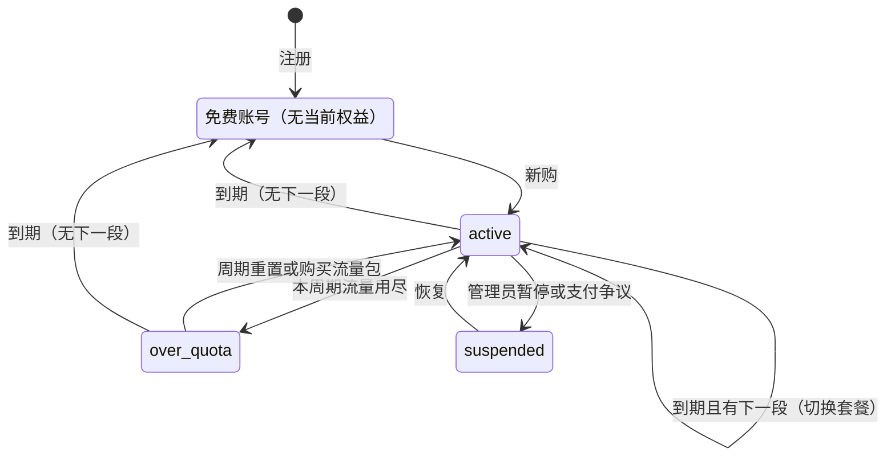

# 11 套餐、权益与节点权限

适用范围：`panel/server/internal/billing`、`internal/access`。订单与支付见 spec/12。

## 11.1 概念

- **套餐** `plans`：可访问的线路组、每周期流量、设备上限、限速、流量重置规则、等级 `tier`（0 保留给免费套餐）、类型（周期、一次性、免费）、上架状态。
- **价格** `plan_prices`：套餐的一个计费周期（月、季、半年、年、一次性）与金额。
- **权益** `entitlements`：账号拥有的套餐实例，保存购买时的参数快照与锁定价格。状态：`scheduled`（下一段）、`active`、`over_quota`、`suspended`、`ended`。
- **免费账号**：没有 `active`、`over_quota`、`suspended` 权益的账号。

## 11.2 规则

- **BIL-01** 价格行一旦创建，金额、币种、周期不可修改，只能停售（`on_sale=false`）。改价 = 停售旧行 + 新建行。
- **BIL-02** 购买时把流量、设备上限、限速、重置规则写入权益快照；之后修改套餐不影响已有权益。管理后台提供显式的“应用到现有用户”操作，执行前显示受影响人数。
- **BIL-03** 权益只能通过追加 `entitlement_events` 并在同一事务中更新 `entitlements` 改变。不存在其他修改路径。
- **BIL-04** 权益的线路组访问关系实时跟随套餐（不快照）。从套餐移除线路组前显示受影响人数。
- **BIL-05** 每个账号同时至多一个当前权益与一个下一段。

## 11.3 购买场景

场景由报价时的权益状态与目标套餐决定（报价与下单流程见 spec/12）。

| 场景 | 条件 | 生效 | 规则 |
|---|---|---|---|
| 新购 | 免费账号 | 支付后立即 | 按**当前在售价格**；锁定该价格；到期 = 现在 + 周期；流量周期从现在开始 |
| 续费 | 权益生效中，购买同一套餐 | 支付后立即 | 按锁定价格计价（BIL-07）；到期时间在原到期时间上顺延；**不重置流量** |
| 升级 | 权益生效中，目标 `tier` 更高或相同 | 支付后立即 | 应付 = 新价格 − 剩余价值；新权益从现在开始完整周期、全额流量；锁定新价格 |
| 降级（默认） | 权益生效中，目标 `tier` 更低 | 当前权益到期时 | 购买新套餐的一个周期作为下一段，到期时自动切换并锁定新价格 |
| 立即降级（可选） | 同上，用户选择立即 | 支付后立即 | 剩余价值折算为新套餐时长，失去的线路组立即收回 |

- **BIL-06** 续费、升级、降级只能在权益为 `active` 或 `over_quota` 时进行；免费账号只能新购（否则 `entitlement_required`）。到期后再买同一套餐属于新购，锁定价格随到期失效。
- **BIL-07** 续费价格 = min(锁定价格, 该周期当前在售价格)；若当前价格更低，锁定价格更新为当前价格行。套餐已下架时，生效中的用户仍可按锁定价格续费（套餐的 `allow_legacy_renew` 为假时除外）。
- **BIL-08** 续费时选择的周期在购买时不存在锁定价格的，按该周期当前价格计价并更新锁定。
- **BIL-09** 一次性套餐不参与升降级，只能新购或叠加。
- **BIL-10** 升级时若存在下一段，下一段取消并将其实付全额退回余额。

## 11.4 剩余价值

```
时间剩余比例 = 剩余时长 ÷ 本段总时长
流量剩余比例 = 本周期剩余流量 ÷ 本周期额度
剩余价值     = 本段实付 × min(时间剩余比例, 流量剩余比例)
升级应付     = max(0, 新价格 − 剩余价值 − 优惠)；剩余价值超出部分记入余额
立即降级时长 = 剩余价值 ÷ 新套餐日均价格（向下取整到小时）
```

- **BIL-11** 剩余价值必须在 [0, 本段实付] 之间，使用整数运算（CONV-06）。
- **BIL-12** 运营者可将折算方式配置为“只按时间”。
- 示例：50 元月付用了 10 天、流量用了一半 → min(20/30, 1/2)=0.5 → 剩余价值 25 元；升级到 80 元月付应付 55 元。

## 11.5 到期与流量周期



- **BIL-13** 没有宽限期。到期时刻权益变为 `ended`，账号回到免费账号，写入 `expire` 事件，所有凭据从节点移除（ACS-02）。账号、设备、订单、余额、导出令牌保留。
- **BIL-14** 到期时存在下一段的，下一段在同一事务中变为 `active`。
- **BIL-15** 可选的免费套餐（`kind=free`，`tier=0`）启用时，自动授予所有免费账号。默认不启用。
- **BIL-16** 流量重置规则：按购买日每月（短月取月末）、按自然月 1 日、或整个有效期不重置。重置切换用量键的周期编号（spec/22 ACC-06），因流量用尽而 `over_quota` 的权益恢复为 `active`。
- **BIL-17** 流量包在周期额度之后消耗，按到期时间从早到晚；默认在当前周期结束时失效。
- **BIL-18** 到期提醒在到期前 7、3、1 天发送，内容说明“到期后原价锁定失效”。
- **BIL-19** 余额自动续费（用户开关，默认关）：到期前 24 小时，若余额足够支付续费价格，自动创建并完成续费订单。

## 11.6 节点权限

权限链：账号 → 当前权益 → 套餐 → 线路组 → 节点。

- **ACS-01** 节点只接收有权访问它的凭据：权益状态为 `active`，且其套餐包含该节点所属的任一线路组。`over_quota` 与 `suspended` 的凭据不下发。
- **ACS-02** 权限协调器消费 `entitlement.changed`、`plan.access_changed`、`node.membership_changed`、`device.revoked`，计算每个节点上新增与失去的凭据，下发 `CredUpsert` / `CredRemove`（spec/20），并递增节点 `config_version`。
- **ACS-03** 所有下发幂等；增量结果必须与全量重算一致（性质测试）。每晚执行一次全量对账并输出差异指标。
- **ACS-04** 节点或线路组可设置流量倍率与限速上限；实际限速取套餐快照与节点上限的较小值。
- **ACS-05** 线路组可设置最低等级；套餐 `tier` 低于该值时即使关联也不下发。
- **ACS-06** 仍被套餐引用的线路组不可删除。

## 11.7 测试要求

- 折算：rapid 性质测试，10 万个随机购买历史，验证 BIL-11 与价值守恒（连续升级再退款后，总支出与总获得价值一致）。
- 状态机：枚举全部状态 × 事件，确认无未定义转换；覆盖到期前 1 秒、到期瞬间、到期后 1 秒。
- 价格锁定：涨价、降价、下架、到期后再购买四种情形。
- 权限协调：随机修改套餐、线路组、节点归属后，增量与全量结果一致。
