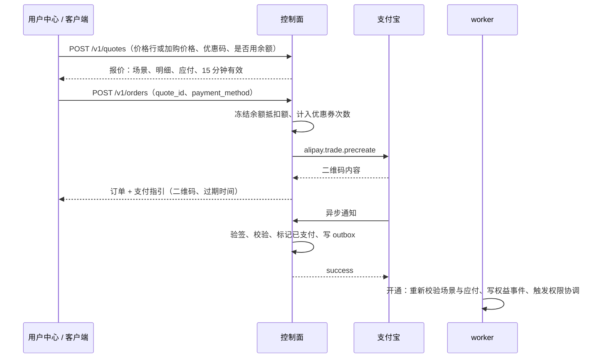

# 12 报价、订单与支付

适用范围：`panel/server/internal/billing`（报价、订单、开通）、`internal/payment`（渠道）。购买场景与计价规则见 spec/11。

## 12.1 报价到开通

- **ORD-01** 报价记录以下内容：
  - 场景：`new`、`renew`、`upgrade`、`downgrade_scheduled`、`downgrade_immediate`、`addon`。
  - 权益与计价：报价时的权益 ID 与 `version`、原价、剩余价值抵扣、优惠、余额抵扣（预估）、应付、开通后的到期时间。

  报价有效期 15 分钟，过期后下单返回 `quote_expired`。请求中的 `price_id` 或 `addon_price_id` 只用来确定购买对象，金额由服务端确定（spec/11 BIL-21）。
- **ORD-02** 同一账号同时最多有一个未支付的变更类订单（续费、升级、降级），以及一个未支付的新购订单。
  - 新下单时，取消同类的旧未支付订单。
  - 取消订单（包括用户调用 `POST /v1/orders/{id}/cancel`）时，同步调用 `alipay.trade.close`；关闭失败且查询显示已支付的，按 ORD-07 处理。
  - 已支付的订单不能取消，返回 409 `invalid_state`。
- **ORD-03** 应付为 0 时（余额足够或优惠抵扣），不调用支付渠道，直接进入开通。`payment_method=credit` 只在应付为 0 时合法，否则返回 400 `invalid_request`。
- **ORD-04** 订单有效期等于支付设置中的“支付超时”，默认 30 分钟。订单过期时关闭支付渠道交易（PAY-08）。
- **ORD-15** 余额抵扣在下单时冻结：
  - 在下单事务中，对账号行加锁（`SELECT … FOR UPDATE`），写入一条负数流水（原因 `order_payment`）。写入后余额必须 ≥ 0，否则返回 `quote_expired`，请用户重新报价。
  - 订单被取消、过期、按 ORD-07 转入余额，或开通时按 ORD-05 判为报价失效，都写一条正数流水退回冻结的金额。
  - 报价中的余额抵扣只是预估，以下单时冻结的金额为准。
- **ORD-05** 开通时重新校验，绝不按过期的折算结果开通：
  1. 场景仍然成立：新购要求账号仍是免费账号；其他场景要求报价时的权益仍是当前权益，ORD-06 的临界续费例外。
  2. 用当前时钟与当前用量重新计算应付（spec/11 BIL-07、11.4）。
     - 重算应付 ≤ 订单应付：开通；差额写入余额（原因 `quote_adjustment`）。
     - 重算应付 > 订单应付，或场景不成立：不开通，把实付全额记入余额（原因 `stale_quote`），归还优惠券次数，并通知用户重新操作。实付全额 = 渠道实收 + 冻结的余额抵扣。
- **ORD-06** 临界续费：续费订单在权益有效期内创建、并在订单有效期内完成支付的，即使支付时权益刚好到期，仍按续费处理并保留锁定价格。开通一个从支付时刻开始的新段，流量周期也从支付时刻开始。
- **ORD-07** 迟到付款：订单已过期或已取消后才到账的付款，一律把实付全额记入余额（原因 `late_payment`），订单状态置为 `credited`，并列入后台待核对，不开通。
- **ORD-08** 标记已支付与写入 `order.paid` 事件在同一事务中；开通由 worker 消费事件完成，以订单 ID 幂等。

## 12.2 支付宝当面付

只内置一个真实渠道：支付宝当面付（扫码支付）。另有测试渠道（12.4）。其他渠道以实现 `PaymentProvider` 接口的方式通过 PR 加入核心，不提供进程外插件。

**适用条件**：站点结算货币为 CNY；运营者已在支付宝开放平台创建应用并签约当面付。

**后台配置**（`payment_providers` 表，`id='alipay_f2f'`）：

| 配置项 | 说明 | 存储 |
|---|---|---|
| 启用 | 开关 | `enabled` |
| 环境 | 正式 / 沙箱，决定网关地址 | `config` |
| AppID | 应用 ID | `config` |
| 签名方式 | 公钥模式或证书模式，二选一 | `config` |
| 应用私钥 | RSA2（SHA256），2048 位 | `secrets_enc`，只写不读 |
| 支付宝公钥 | 公钥模式 | `config` |
| 应用公钥证书、支付宝公钥证书、支付宝根证书 | 证书模式 | `config` |
| 异步通知地址 | 默认由站点 API 域名生成，可覆盖 | `config` |
| 订单标题模板 | 如 `{site}-{plan}-{period}`，不含个人信息 | `config` |
| 支付超时 | 默认 30 分钟，即订单有效期（ORD-04） | `config` |

- **PAY-01** 应用私钥保存后只显示“已设置”，在接口、日志、审计记录中永不出现。
- **PAY-02** “测试连接”用当前配置调用 `alipay.trade.query` 查询一个不存在的订单号；返回交易不存在即表示配置正确，其他错误原样提示。
- **PAY-03** 结算货币不是 CNY 时不允许启用；未启用或配置无效时，下单返回 `payment_unavailable`。
- **PAY-04** 预创建：
  - `out_trade_no` = 订单号；`total_amount` 由 `amount_due_minor` 整数换算为两位小数字符串（`3000 → "30.00"`）。
  - `timeout_express` = 订单剩余有效秒数，向下取整到分钟；不足 1 分钟时不再预创建，返回 `quote_expired`。
  - 二维码内容存入 `orders.payment_payload`。
- **PAY-05** 异步通知的处理顺序：
  1. 验签（公钥或证书），失败则记录并拒绝；
  2. 校验 `app_id` 等于当前配置；
  3. 校验 `out_trade_no` 对应的订单存在；
  4. 校验 `total_amount` 与订单应付完全相等。不相等时记录 `rejected_amount`，列入待核对（M4-05 对账工作台），同样返回 `success`，不开通；
  5. `trade_status` 为 `TRADE_SUCCESS` 或 `TRADE_FINISHED` 时，以 `(alipay_f2f, trade_no)` 为幂等键处理：
     - 订单为 `pending`：标记已支付，把 `buyer_id` 的 SHA-256 写入 `orders.payer_ref_hash`（spec/13 OPS-07）；
     - 订单为已过期或已取消：按 ORD-07 处理，记录 `late_paid`；
  6. 返回纯文本 `success`。重复通知同样返回 `success`，不重复开通。
- **PAY-06** 验签在任何数据库写入之前完成。每条通知（无论结果）都写入只追加的 `payment_notifications`，`result` 记录处理结论。写入前从原文中去除买家账号类字段（`buyer_logon_id`、`buyer_user_id` 等，CONV-29）。
- **PAY-07** 查询兜底：订单待支付时，worker 在创建后第 1、3、10 分钟调用 `alipay.trade.query`，查到已支付则按 PAY-05 第 4–5 步入账。
- **PAY-08** 订单过期时调用 `alipay.trade.close`；关闭失败且查询显示已支付的，按 ORD-07 处理。
- **PAY-09** 通知接口只接受 POST 表单，并限制请求体大小。
- **PAY-10** 签名、验签与请求可以自行实现，也可以使用许可证与 AGPL 兼容的 SDK；必须有基于沙箱录制数据（去敏）的单元测试。

## 12.3 退款与余额

- **ORD-09** 退款在后台发起（敏感操作，spec/10 AUTH-19），可选原路退回（`alipay.trade.refund`，`out_request_no` = 退款记录 ID，重试幂等）或退回余额。
  - 可退金额 = min(按 spec/11 计算的剩余价值（加购项按 BIL-25）, 该订单的渠道实收 + 余额抵扣 − 已退金额)。
  - 原路退回部分 ≤ 渠道实收 − 已原路退回的金额；超出部分只能退回余额，不能把余额抵扣的部分套现。
  - 同一订单的退款在订单行锁下串行执行，累计不超过可退金额。
  - 全额退款后订单状态为 `refunded`；部分退款后仍为 `fulfilled`，并累计记录已退金额。
- **ORD-10** 退款成功后，写入余额流水（原路退回时为审计记录）与 `refund` 权益事件：
  - 剩余时长 × (1 − 退款额 ÷ 退款前的剩余价值)，向下取整到秒；
  - 本段实付减去退款额；
  - 剩余时长降为 0 时权益 `ended`；
  - 优惠券次数不归还。
- **ORD-11** 余额由 `credit_ledger` 的只追加流水求和；下单时按 ORD-15 抵扣；管理员调整必须填写原因并写审计。
- **ORD-12** 手动标记支付只允许 `superadmin`，任何角色都不能被授予（spec/10 AUTH-22）；需要重新验证、二次确认与原因（AUTH-19）。

## 12.4 测试渠道

- **PAY-11** `id='test'`，仅在 `env=dev` 或 `env=test` 时可启用；生产环境检测到启用时拒绝启动。
- 下单返回本地收银台页面，可以模拟支付成功、失败、重复通知、金额不符、过期到账，供前端开发与端到端测试。

## 12.5 优惠券与兑换码

- **ORD-13** 优惠券：
  - 类型为固定金额或百分比（基点，`value ≤ 10000`），可以限定套餐、周期、订单场景、总次数、每人次数、有效期；码值只存哈希。
  - 一张报价最多使用一张券。
  - 百分比券的基数 = 应付前金额，即 max(0, 新价格 − 剩余价值)，结果向下取整；优惠额不超过该基数。优惠永不转为余额（spec/11 11.4）。
  - 次数在下单时计入：在券行锁下写入 `coupon_redemptions`，同时校验总次数与每人次数。订单被取消、过期、转入余额，或报价失效（ORD-05）时，删除该记录，归还次数。
- **ORD-14** 兑换码：
  - 用途为充值余额，或直接开通套餐（事件类型 `redeem`）。
  - 码值为 16 位随机字符（去除易混字符），只存哈希；可以限次、设有效期；批量生成。明文只在生成批次时返回一次（spec/31）。
  - 每次兑换写入 `redeem_redemptions(redeem_code_id, account_id, credit_ledger_id | entitlement_id)`，同一账号对同一码只能兑换一次。`used_count` 用 `UPDATE … WHERE used_count < max_uses` 原子递增。
  - 套餐兑换码只在两种情况下可用：免费账号（按新购开通），或持有同一套餐（按续费开通）。其他情况返回 `entitlement_required`。兑换开通的权益，本段实付为 0。

## 12.6 测试要求

- 支付宝：验签失败、`app_id` 不符、金额不符、重复通知、过期到账、取消后到账、查询兜底、关闭、原路退款、退回余额。
- 开通：
  - 报价后用量变化与价格变化时的重算（ORD-05）；
  - 到期临界续费（ORD-06）；
  - 并发提交续费与升级时只有一个按报价开通；
  - 两张新购订单先后到账时，第二张转入余额。
- 余额：两个并发订单争用同一笔余额时，余额不会变为负数（ORD-15）。
- 退款：多次部分退款的累计上限；余额抵扣的部分只能退回余额。
- 手动验收：在沙箱中真实完成一次扫码支付与退款。
