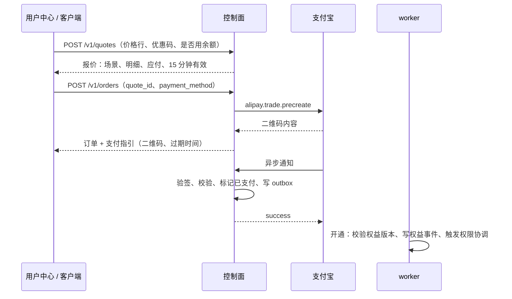

# 12 报价、订单与支付

适用范围：`panel/server/internal/billing`（报价、订单、开通）、`internal/payment`（渠道）。购买场景与计价规则见 spec/11。

## 12.1 报价到开通

- **ORD-01** 报价记录：场景（`new`、`renew`、`upgrade`、`downgrade_scheduled`、`downgrade_immediate`、`addon`）、原价、剩余价值抵扣、优惠、余额抵扣、应付、开通后的到期时间、报价时的权益 `version`。有效期 15 分钟，过期下单返回 `quote_expired`。
- **ORD-02** 同一账号同时只允许一个未支付的变更类订单（续费、升级、降级）；新下单时取消旧的未支付订单。
- **ORD-03** 应付为 0 时（余额足够或优惠抵扣）不调用支付渠道，直接进入开通。
- **ORD-04** 订单有效期 30 分钟，过期时关闭支付渠道交易。
- **ORD-05** 开通时比较权益当前 `version` 与报价记录的值：一致则开通；不一致则把实付全额记入余额（原因 `stale_quote`）并通知用户重新操作，绝不按过期的折算结果开通。
- **ORD-06** 续费订单在权益有效期内创建、并在订单有效期内完成支付的，即使支付时权益刚好到期，仍按续费处理并保留锁定价格，到期时间从支付时刻起算。
- **ORD-07** 订单过期后才到账的付款：套餐与价格仍有效则照常开通；否则记入余额并列入后台待核对。
- **ORD-08** 标记已支付与写入 `order.paid` 事件在同一事务；开通由 worker 消费事件完成，以订单 ID 幂等。

## 12.2 支付宝当面付

只内置一个真实渠道：支付宝当面付（扫码支付）。另有测试渠道（12.4）。其他渠道以实现 `PaymentProvider` 接口的方式通过 PR 加入核心。不提供进程外插件。

**适用条件**：站点结算货币为 CNY；运营者已在支付宝开放平台创建应用并签约当面付。

**后台配置**（`payment_providers` 表，`id='alipay_f2f'`）：

| 配置项 | 说明 | 存储 |
|---|---|---|
| 启用 | 开关 | `enabled` |
| 环境 | 正式 / 沙箱，决定网关地址 | `config` |
| AppID | 应用 ID | `config` |
| 签名方式 | 公钥模式或证书模式，二选一 | `config` |
| 应用私钥 | RSA2（SHA256），2048 位 | `secrets_enc`，只写不读 |
| 支付宝公钥 | 公钥模式 | `config` |
| 应用公钥证书、支付宝公钥证书、支付宝根证书 | 证书模式 | `config` |
| 异步通知地址 | 默认由站点 API 域名生成，可覆盖 | `config` |
| 订单标题模板 | 如 `{site}-{plan}-{period}`，不含个人信息 | `config` |
| 支付超时 | 默认 30 分钟 | `config` |

- **PAY-01** 应用私钥保存后只显示“已设置”，接口、日志、审计记录中永不出现。
- **PAY-02** “测试连接”用当前配置调用 `alipay.trade.query` 查询一个不存在的订单号；返回交易不存在即表示配置正确，其他错误原样提示。
- **PAY-03** 结算货币不是 CNY 时不允许启用；未启用或配置无效时下单返回 `payment_unavailable`。
- **PAY-04** 预创建：`out_trade_no` = 订单号，`total_amount` 由 `amount_due_minor` 整数换算为两位小数字符串（`3000 → "30.00"`），`timeout_express` = 订单剩余有效期。二维码内容存入 `orders.payment_payload`。
- **PAY-05** 异步通知处理顺序：
  1. 验签（公钥或证书），失败则记录并拒绝；
  2. `app_id` 等于当前配置；
  3. `out_trade_no` 对应的订单存在；
  4. `total_amount` 与订单应付完全相等；
  5. `trade_status` 为 `TRADE_SUCCESS` 或 `TRADE_FINISHED` 时，以 `(alipay_f2f, trade_no)` 为幂等键标记已支付；
  6. 返回纯文本 `success`。重复通知同样返回 `success`，不重复开通。
- **PAY-06** 验签在任何数据库写入之前完成。每条通知（无论结果）写入只追加的 `payment_notifications`，`result` 记录处理结论。
- **PAY-07** 查询兜底：订单待支付时，worker 在创建后第 1、3、10 分钟调用 `alipay.trade.query`，查到已支付则按 PAY-05 第 4–5 步入账。
- **PAY-08** 订单过期时调用 `alipay.trade.close`；关闭失败且查询显示已支付的，按 ORD-07 处理。
- **PAY-09** 通知接口只接受 POST 表单并限制请求体大小。
- **PAY-10** 签名、验签与请求可自行实现，或使用许可证与 AGPL 兼容的 SDK；必须有基于沙箱录制数据（去敏）的单元测试。

## 12.3 退款与余额

- **ORD-09** 退款在后台发起，可选原路退回（`alipay.trade.refund`，`out_request_no` = 退款记录 ID，重试幂等）或退回余额。可退金额按 spec/11 剩余价值公式计算。
- **ORD-10** 退款成功后写入余额流水（原路退回时为审计记录）与权益事件，权益按退款比例缩短或结束。
- **ORD-11** 余额由 `credit_ledger` 只追加流水求和；下单时可抵扣；管理员调整必须填写原因并写审计。
- **ORD-12** 手动标记支付仅限 `superadmin`，需二次确认与原因。

## 12.4 测试渠道

- **PAY-11** `id='test'`，仅在 `env=dev` 或 `env=test` 可启用；生产环境检测到启用时拒绝启动。
- 下单返回本地收银台页面，可模拟支付成功、失败、重复通知、金额不符、过期到账，供前端开发与端到端测试。

## 12.5 优惠券与兑换码

- **ORD-13** 优惠券：固定金额或百分比（基点），限定套餐、周期、订单场景、总次数、每人次数、有效期；码值只存哈希。
- **ORD-14** 兑换码：充值余额或直接开通套餐（按新购或续费规则执行，事件类型 `redeem`）；16 位随机字符（去除易混字符），只存哈希，可限次与设有效期；批量生成。

## 12.6 测试要求

- 支付宝：验签失败、`app_id` 不符、金额不符、重复通知、过期到账、查询兜底、关闭、原路退款、退回余额。
- 开通：报价后权益变化（ORD-05）、到期临界续费（ORD-06）、并发提交续费与升级只有一个按报价开通。
- 手动验收：沙箱中真实完成一次扫码支付与退款。
