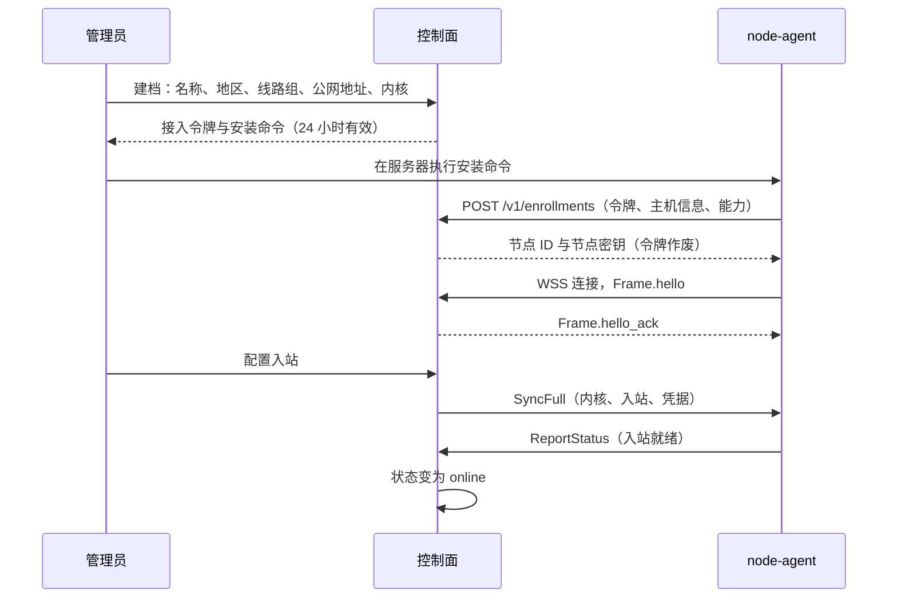

# 20 节点协议

适用范围：`panel-spec/proto/node/v1`（字段级事实来源）、`panel/server/internal/gateway`、`panel/server/e2e/fakeagent`、`node-agent` 通信层。

## 20.1 节点接入

- **NODE-01** 节点必须先在控制面建档（名称、地区、线路组、公网地址、内核，默认 sing-box）。建档生成一次性接入令牌，24 小时有效，只存哈希。
- **NODE-02** Agent 以 `POST /v1/enrollments`（gateway 域名）提交接入令牌、主机信息与能力清单，换取节点 ID 与节点密钥（PSK）。令牌随即作废。PSK 在控制面加密存储，在 Agent 本地保存为 0600 权限的文件。
- **NODE-03** 重新签发接入令牌时保留节点 ID、线路组、入站与路由配置；旧 PSK 在新 Agent 接入后吊销。
- **NODE-04** 控制面可在建档或添加入站时生成 Reality 密钥对与短 ID。

| 节点状态 | 含义 | 出现在用户配置中 |
|---|---|---|
| `pending_enroll` | 已建档，未接入 | 否 |
| `pending_config` | 已连接，没有启用的入站 | 否 |
| `online` | 入站就绪，90 秒内有心跳 | 是 |
| `offline` | 超过 90 秒无心跳 | 默认是（客户端测速会避开），可配置为否 |
| `maintenance` | 管理员设置 | 否；已有连接不强制断开 |

## 20.2 传输

- **NODE-05** 主通道：`wss://gateway.运营者域名/v1/stream`，WebSocket 二进制帧，每帧一个 `Frame`。
- **NODE-06** 备用通道：WebSocket 连续失败 3 次后，改用 `POST /v1/sync`（请求体与响应体为 `Frame` 序列，服务端最多挂起 25 秒）。帧格式、加密、确认完全相同。每 10 分钟尝试恢复 WebSocket。
- **NODE-07** 保活：每 25 秒 Ping，连续 3 次无响应即重连。重连等待 `random(0, min(30s, 1s × 2ⁿ))`。网关做连接准入限速，超限返回 503 与 `Retry-After`。

## 20.3 握手（与传输无关，在首个帧中完成）

1. Agent 发送 `Frame.hello`：`node_id`、`ts_ms`、16 字节 `nonce`、`proto_version`、X25519 临时公钥、`Capabilities`、本地 `config_version`，以及 `mac`（HMAC-SHA256，覆盖字段与拼接方式以 `envelope.proto` 中 `Hello.mac` 的注释为准）。
2. 网关校验：
   - **NODE-08** `|now − ts_ms| ≤ 60 s`；
   - **NODE-09** `nonce` 以 `SET NX EX 180` 写入 Valkey，已存在即拒绝（防重放）；
   - **NODE-10** MAC 常量时间比较；新旧两个 PSK 均可验证（轮换期）。
3. 网关回复 `Frame.hello_ack`：服务端临时公钥、协议版本、`mac`、`sync_mode`（增量或全量）。
4. 双方用 X25519 共享密钥经 HKDF-SHA256 派生会话密钥（上下文包含 `node_id` 与双方公钥）。
5. **NODE-11** 此后所有帧为 `Frame.sealed`：XChaCha20-Poly1305 密文，明文为 `Envelope`，附加数据为方向（1 字节）与 `seq`（8 字节大端）。
6. 握手 5 秒内未完成即关闭连接。

## 20.4 可靠投递

- **NODE-12** 每个方向独立递增 `Frame.seq`；`Envelope.ack` 捎带已收到对端的最大连续序号。
- **NODE-13** 投递语义为“至少一次 + 幂等”：发送方保留未确认的信封，重连后重传；接收方以 `idem_key` 去重。所有指令写成幂等形式（“设为”而非“切换”）。
- **NODE-14** 待确认窗口有上限（默认 1,000 条或 8 MiB）；超出时丢弃积压并改发一次全量同步。

## 20.5 消息

| 消息（`Envelope.body`） | 方向 | 用途 |
|---|---|---|
| `SyncFull` | 控制面 → 节点 | 全量快照：`config_version`、**内核**、入站、凭据、路由、校验和 |
| `SyncDelta` | 控制面 → 节点 | 增量：凭据新增与移除，`from_version` → `to_version` |
| `CredUpsert` / `CredRemove` | 控制面 → 节点 | 凭据变化；移除时关闭该凭据全部会话 |
| `QuotaLease` | 控制面 → 节点 | 发放或回收账号在该节点的字节预算（spec/22） |
| `InboundApply` | 控制面 → 节点 | 入站配置与内核；会中断该入站现有连接 |
| `RoutesApply` | 控制面 → 节点 | 自定义路由与出站、加密的 DNS 服务商凭据 |
| `AgentUpgrade` | 控制面 → 节点 | 新版本地址、SHA-256、签名 |
| `ReportTraffic` | 节点 → 控制面 | 按凭据的增量字节，带 `report_seq` |
| `ReportStatus` | 节点 → 控制面 | 负载、连接数、吞吐、配置版本、各入站健康状态 |
| `LeaseRequest` | 节点 → 控制面 | 续租 |
| `Ack` | 双向 | 纯确认 |

- **NODE-15** 重连后，节点 `config_version` 落后且控制面仍保留中间变更时发增量，否则发全量。全量快照带 SHA-256 校验和，Agent 校验后原子替换。
- **NODE-16** 新能力通过 `Capabilities` 字段声明；控制面只向声明了该能力的节点发送对应消息。
- **NODE-17** 协议变更遵循 spec/42 的兼容规则：字段只增不改，删除的编号写入 `reserved`。

## 20.6 测试要求

- 协议一致性套件 `panel/server/e2e/conformance`：以模拟 Agent 为对象开发，同一套件在 M3 对真实 Agent 运行。
- 覆盖：重放握手、时钟偏差、PSK 轮换、断线 100 次后指令不丢不重、窗口溢出转全量、1,000 个模拟节点同时重连。
