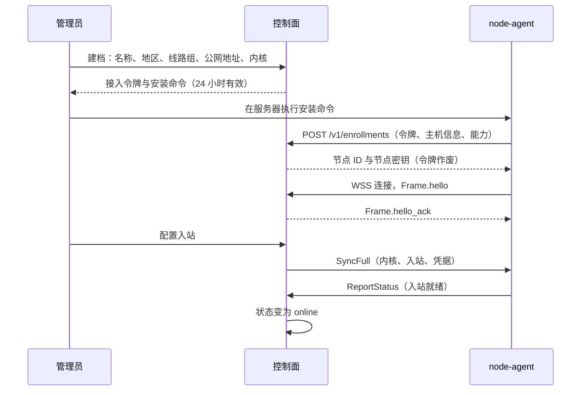

# 20 节点协议

适用范围：`panel-spec/proto/node/v1`（字段级事实来源）、`panel/server/internal/gateway`、`panel/server/e2e/fakeagent`、`node-agent` 通信层。字节级的编码细节（MAC 输入、密钥派生、密文布局）以 proto 文件中的注释为准；本文件给出规则，两者冲突时先修正其中一方再实现。

## 20.1 节点接入

- **NODE-01** 节点必须先在控制面建档（名称、地区、线路组、公网地址、内核，默认 sing-box）。建档时生成一次性接入令牌，24 小时有效，只存哈希。
- **NODE-02** Agent 以 `POST /v1/enrollments`（gateway 域名）提交接入令牌、主机信息与能力清单，换取节点 ID 与节点密钥（PSK）。
  - PSK 在控制面加密存储（CONV-19），在 Agent 本地保存为 0600 权限的文件。
  - 令牌在首次成功后作废。首次成功后 10 分钟内，以同一令牌、同一主机指纹重复提交的，返回相同结果，以便 Agent 在响应丢失后重试；其他情况返回 404。
- **NODE-18** 接入接口的请求与响应在 `panel-spec/proto/node/v1/enrollment.proto` 中定义：HTTP 请求体与响应体为对应消息的 protobuf 编码，错误为 problem+json（ARC-01）。
- **NODE-03** 重新签发接入令牌时，保留节点 ID、线路组、入站与路由配置。新 Agent 接入后，新 PSK 写入 `psk_enc`，旧 PSK 移到 `psk_prev_enc`。新 PSK 首次握手成功时，在同一事务中清空 `psk_prev_enc`，并关闭以旧 PSK 建立的全部会话。
- **NODE-19** 立即吊销节点密钥（节点失陷，spec/40 40.4）：
  - 管理员调用 `/v1/hosts/{id}/key-revocations`（敏感操作）后，在同一事务中清空 `psk_enc` 与 `psk_prev_enc`，节点状态回到 `pending_enroll`。
  - 立即关闭该节点的全部会话，关闭时发送 `HelloReject(revoked)` 或关闭码 4006。
  - 重新接入必须签发新的接入令牌。
- **NODE-04** 控制面可以在建档或添加入站时生成 Reality 密钥对与短 ID。

- **NODE-20** 节点状态与心跳：
  - 心跳指控制面收到该节点的任意有效信封，收到时更新 `nodes.last_seen_at`。Agent 每 30 秒发送一次 `ReportStatus`。
  - “入站就绪”指至少一个启用的入站 `listening=true`，并且 `ReportStatus.config_version` 等于控制面当前值。

| 节点状态 | 进入条件 | 出现在用户配置中 |
|---|---|---|
| `pending_enroll` | 已建档未接入；或密钥被吊销（NODE-19） | 否 |
| `pending_config` | 已连接，但没有启用的入站，或入站尚未就绪 | 否 |
| `online` | 入站就绪，且 90 秒内有心跳 | 是 |
| `offline` | 超过 90 秒无心跳；恢复心跳且入站就绪后回到 `online` | 默认是（客户端测速会避开），可以配置为否 |
| `maintenance` | 只能由管理员设置与解除；解除后按上述条件重新判定 | 否；已有连接不强制断开 |

## 20.2 传输

- **NODE-05** 主通道为 `wss://gateway.运营者域名/v1/stream`，使用 WebSocket 二进制帧，每帧一个 `Frame`。
- **NODE-06** 备用通道（M5-02）：WebSocket 连续失败 3 次后，改用 `POST /v1/sync`，服务端最多挂起 25 秒，每 10 分钟尝试恢复 WebSocket。
  - 请求体与响应体为若干个 `uint32 大端长度 ‖ Frame`。
  - 首个请求只含 `hello`；响应含 `hello_ack`，并在响应头 `Session-Id` 中返回会话 ID。后续请求带上这个头。
  - 会话状态（会话密钥、序号）保存在 Valkey 中，TTL 60 秒，任一网关实例都能取用。
  - 一次请求失败即视为断线，按 NODE-12 重传。
- **NODE-07** 保活：
  - 每 25 秒发送一次 Ping，连续 3 次无响应即重连。重连前等待 `random(0, min(30s, 1s × 2ⁿ))`。
  - 网关做连接准入限速，超限返回 503 与 `Retry-After`。这是面向 Agent 的 HTTP 响应，不使用 CONV-16 的错误码。
- **NODE-21** 同一个 `node_id` 同时至多有一条已认证会话。新会话握手成功后，网关在同一 `node_id` 的注册表项上以比较并写入的方式记录新会话（spec/40 DEP-07），并关闭旧会话（`hello_reject(superseded)` 或关闭码 4007）。旧会话上未确认的指令不转交，由新会话按 NODE-15 的版本同步补齐。

## 20.3 握手（与传输无关，在首个帧中完成）

1. Agent 发送 `Frame.hello`，包含：`node_id`、`ts_ms`、16 字节 `nonce`、`proto_version`、X25519 临时公钥、序列化后的 `Capabilities`（`bytes`）、本地 `config_version`、`mac`。
   - `mac` 为 HMAC-SHA256，覆盖字段与拼接方式以 `envelope.proto` 中 `Hello.mac` 的注释为准。
   - MAC 与校验和一律按实际收到的原始字节计算，接收方不重新序列化后再计算。这样旧网关收到带新能力字段的 `Hello` 时，校验结果不受影响。
2. 网关校验：
   - **NODE-08** `|now − ts_ms| ≤ 60 s`；
   - **NODE-09** `nonce` 以 `SET NX EX 180` 写入 Valkey，已存在即拒绝，用于防重放。Valkey 不可用时拒绝新握手（spec/40 40.4）；
   - **NODE-10** MAC 用常量时间比较。只有在重新接入的过渡期内（NODE-03，从新 Agent 接入到新 PSK 首次握手成功，最长 24 小时），新旧两个 PSK 都可以通过验证；
   - `proto_version` 在网关支持的范围内。
3. 校验通过后，网关回复 `Frame.hello_ack`，包含：服务端临时公钥、选定的协议版本、控制面能力位、该节点已入账的最大 `report_seq`（spec/22 ACC-03）、`sync_mode`（增量或全量），以及 `mac`。`mac` 使用验证通过 `Hello` 的那个 PSK 计算。
4. **NODE-11** 会话密钥与信封加密：
   - 会话密钥：`K = HKDF-SHA256(ikm = X25519 共享密钥, salt = Hello.nonce, info = "akari-node-session-v1" ‖ node_id（16 字节）‖ Agent 临时公钥 ‖ 服务端临时公钥, L = 64)`。前 32 字节用于 Agent → 控制面方向，后 32 字节用于控制面 → Agent 方向。
   - 此后所有帧都是 `Frame.sealed`：`sealed = nonce（24 字节，每帧用 CSPRNG 新生成）‖ XChaCha20-Poly1305 密文与 tag`，明文为 `Envelope`。
   - 附加数据为方向字节（Agent → 控制面为 `0x01`，控制面 → Agent 为 `0x02`）‖ `seq`（8 字节大端）。
   - nonce 不得由 `seq` 派生，以免重传时用同一 nonce 加密不同的明文。
5. 握手 5 秒内未完成即关闭连接。长轮询按请求计时。
- **NODE-22** 握手失败时，网关先发送 `Frame.hello_reject{reason, retry_after_ms}`，再关闭连接；WebSocket 同时使用对应的关闭码。`hello_reject` 在握手认证之前发送，不带 MAC，完整性只依赖 TLS，因此任何原因都不会让 Agent 永久停止重连。Agent 按原因处理：

| `reason` | 关闭码 | Agent 行为 |
|---|---|---|
| `clock_skew` | 4001 | 记录日志，按 NODE-07 退避重试；`agentctl doctor` 提示检查时钟 |
| `auth_failed` | 4002 | 指数退避，上限 1 小时 |
| `replay` | 4003 | 生成新的 nonce 后立即重试 |
| `version_unsupported` | 4004 | 记录日志，改为每小时重试一次，升级后立即重试 |
| `busy` | 4005 | 按 `retry_after_ms` 等待后重试 |
| `revoked` | 4006 | 提示需要重新接入，改为每小时重试一次 |
| `superseded` | 4007 | 同一节点有更新的会话（NODE-21）。本进程另有更新的会话时，只关闭这条旧连接；否则记录日志，提示可能有重复运行的 Agent，并改为每小时重试一次 |

## 20.4 可靠投递

- **NODE-12** 序号与确认：
  - 握手帧（`hello`、`hello_ack`、`hello_reject`）的 `seq` 为 0。之后在一次握手的会话内，每个方向从 1 开始递增。`Envelope.ack` 捎带已收到对端的最大连续序号。
  - 会话内出现重复或不递增的 `seq` 时，关闭连接。WebSocket 基于有序可靠的 TCP，同一连接内不做超时重传。
  - 重连后，发送方把未确认的信封以新会话的 `seq` 重发，`idem_key` 保持原值。
- **NODE-13** 投递语义为“至少一次 + 幂等”：
  - `idem_key` 为发送方生成的 UUIDv7。接收方的去重记录至少保留 24 小时，Agent 侧写入本地状态（spec/21 AGT-05）。
  - 所有指令都写成幂等形式（“设为”而非“切换”）。
  - `Envelope.ack` 只表示“已收到”，不表示“已应用”。控制面以 `ReportStatus.config_version` 判断节点已应用到哪个版本。
- **NODE-23** 带版本的指令：
  - 控制面每次向某节点下发配置变更，都在同一事务中把该节点的 `config_version` 加 1（spec/11 ACS-02）；重传的指令保持原版本号。
  - 收到 `SyncFull` 时，版本高于本地才应用，否则只确认不应用。
  - 收到增量指令（`SyncDelta`、`CredUpsert`、`CredRemove`、`InboundApply`、`RoutesApply`）时：版本不大于本地的，只确认不应用；版本等于本地加 1 的，应用；版本跳号的，不应用，改为请求全量同步。
  - 请求全量同步的方式是断开连接后重连，并在 `Hello` 中把 `config_version` 设为 0。
  - 快照校验失败、指令应用失败或内核切换失败时，Agent 保留原配置（spec/21 AGT-07），不前进已应用的版本号，并按上一条请求全量同步。同一节点 10 分钟内失败 3 次，控制面告警。
- **NODE-14** 待确认窗口有上限（默认 1,000 条或 8 MiB），两个方向的处理不同：
  - 控制面 → 节点：超出时丢弃积压，改发一次 `SyncFull`。节点在收到全量后，为仍有连接的账号重新申请配额租约（spec/22 ACC-08）。
  - 节点 → 控制面：流量报告永不丢弃。窗口满时暂停发送（背压），报告继续留在 WAL 中，确认后再分批发送，每批不超过窗口上限。

## 20.5 消息

| 消息 | 方向 | 用途 |
|---|---|---|
| `Frame.hello` / `hello_ack` / `hello_reject` | 双向 | 握手（20.3） |
| `SyncFull` | 控制面 → 节点 | 全量快照：`config_version`、**内核**、入站、凭据、路由、DNS 服务商凭据、离线参数（spec/22 ACC-19）、校验和。必须能单独重建节点的全部配置状态 |
| `SyncDelta` | 控制面 → 节点 | 增量：凭据新增与移除，`from_version` → `to_version`；只能表达凭据变化（NODE-15） |
| `CredUpsert` / `CredRemove` | 控制面 → 节点 | 凭据变化；移除一律关闭会话（NODE-24） |
| `QuotaLease` | 控制面 → 节点 | 发放或回收账号在该节点的字节预算（spec/22） |
| `InboundApply` | 控制面 → 节点 | 该节点的**全部**入站与内核，全量替换；只中断被修改或删除的入站上的连接 |
| `RoutesApply` | 控制面 → 节点 | 自定义路由与出站、加密的 DNS 服务商凭据（NODE-25） |
| `AgentUpgrade` | 控制面 → 节点 | 新版本地址、SHA-256、签名与签名 `key_id`（spec/40 DEP-09） |
| `ReportTraffic` | 节点 → 控制面 | 按凭据的增量字节，带 `report_seq`；租约结算字段见 spec/22 |
| `ReportStatus` | 节点 → 控制面 | 负载、连接数、吞吐、已应用的 `config_version`、当前运行的内核与切换错误、各入站健康状态 |
| `LeaseRequest` | 节点 → 控制面 | 首次申请、续租与释放租约（spec/22 ACC-08、ACC-10） |
| `Ack` | 双向 | 纯确认 |

- **NODE-15** 重连后的同步：
  - 节点 `config_version` 落后，且中间变更全部是凭据变化、控制面仍保留这些变更时，发增量；否则发全量。
  - 控制面至少保留每个节点最近 24 小时或最近 10,000 个版本的凭据变更。
  - 全量快照带 SHA-256 校验和，覆盖快照的原始字节（20.3 第 1 步）。Agent 校验后原子替换本地快照。
- **NODE-24** 凭据经任何途径从节点移除，包括 `CredRemove`、`SyncDelta.removals`、全量快照中不再出现、`Credential.expires_at_ms` 到期，Agent 都必须在 1 秒内关闭其全部连接（spec/21 AGT-12）。协议中没有“移除但不关闭”的选项。
- **NODE-25** DNS 服务商凭据以 `K_dns = HKDF-SHA256(ikm = PSK, salt = 空, info = "akari-dns-secret-v1", L = 32)` 做 XChaCha20-Poly1305 加密后下发，附加数据为空；PSK 取当前会话通过验证的那一把。Agent 只在内存中解密。PSK 变化后，控制面用新 PSK 重新加密并下发。
- **NODE-16** 新能力通过 `Capabilities` 字段声明，控制面只向声明了该能力的节点发送对应消息。反方向同理：`HelloAck` 带控制面能力位，Agent 只向声明了该能力的控制面发送新增的上报消息。
- **NODE-17** 协议变更遵循 spec/42 的兼容规则：字段只增不改，删除的编号写入 `reserved`。

## 20.6 测试要求

- 协议一致性套件 `panel/server/e2e/conformance`：以模拟 Agent 为对象开发，同一套件在 M3 对真实 Agent 运行。
- 覆盖：
  - 握手：重放握手、时钟偏差、`hello_reject` 的每种原因；
  - 密钥：重新接入的过渡期、立即吊销；
  - 连接：同一节点两条连接；
  - 投递：断线 100 次后指令效果不丢不重；旧版本指令晚于全量快照到达时不被应用；
  - 同步：窗口溢出转全量；中间含非凭据变更时发全量；
  - 规模：1,000 个模拟节点同时重连。
- 会话加密提供测试向量（固定的密钥、nonce 与明文），模拟 Agent 与真实 Agent 都必须通过。
